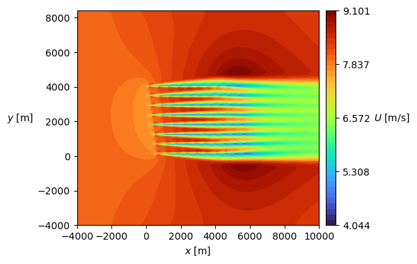
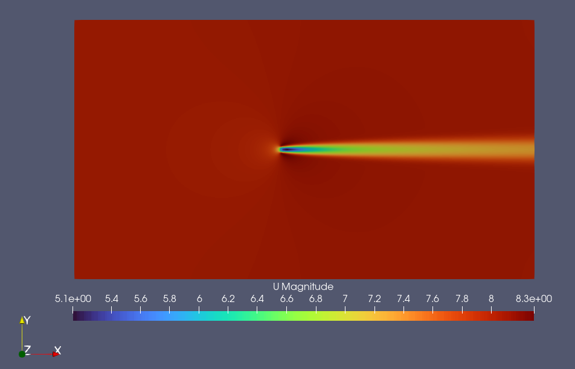
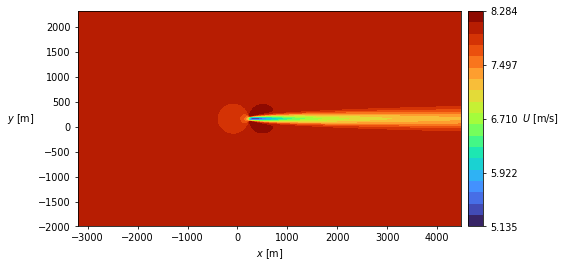

# farm2d

A setup to run 2D RANS simulations of wind farm flows in OpenFOAM.

Since `farm2d` is relatively fast, you can run the simulations on a regular laptop. This simulation of Horns Rev 1 ran in 96 seconds on my laptop (using 4 cores).



The idea of `farm2d` is to automate the process of grid generation, turbine setup, and running the OpenFOAM simulation through a simple Python framework. In its current version, it works by modifying the files of an existing OpenFOAM case.

## Installation

Assuming that your git projects are located at `~/git` on your computer:
```
cd git
git clone https://github.com/mchba/farm2d.git
```

*Or download the repository as a ZIP-file or any other way you like*.

### OpenFOAM and the actuator disk (AD)

To use `farm2d` you need to install OpenFOAM and a custom acutator disk (AD)
 model called [actuatorDiskFoam](https://github.com/mchba/actuatorDiskFoam). Instructions on the installation are given on the actuatorDiskFoam front page.


### Python

It is recommended to use a virtual Python environment, for example through [Miniconda](https://docs.anaconda.com/miniconda/). Assuming you already have a conda installation, create a new environment as:

```
conda create -n farm2d python spyder numpy scipy xarray matplotlib pyvista
conda activate farm2d
```

*Note: The pyvista package does not work on [ARC](https://arc-user-guide.readthedocs.io/en/latest/index.html), but is also not strictly necessary to run `farm2d`.*

Also add `farm2d` to your `~/.bashrc`-file:

```
# Add this somewhere in your bashrc-file:
export PYTHONPATH="${PYTHONPATH}:/home/<username>/git/farm2d/src"
```

## How to run

### Native OpenFOAM

You can actually run any of the examples with "pure" OpenFOAM. This does not require any Python installation.
```
cd examples
cp V80 my_first_test -r
cd my_first_test
./Allrun
```

This case runs in about 3 seconds on my laptop (using 4 cores). You can take a look at the results with for example `ParaFoam` or `Paraview`.

```
paraview test.foam &
```




### With Python

The main advantage of running through Python is that you can easily modify the example cases and automate various tasks.

```
cd examples
cp V80 my_second_test -r
cd my_second_test
python setup_case.py
```

A contour plot was automatically created with the python script:




## License

This project is released under the MIT License.

You are free to use, modify, and distribute the code for academic purposes, commercial projects, personal experiments, or any other purpose. However, the code is provided "as-is," without any warranty of any kind. The developers of this project are not liable for any damages or issues arising from the use of this software. Users bear sole responsibility for the results obtained or consequences arising from its use.


